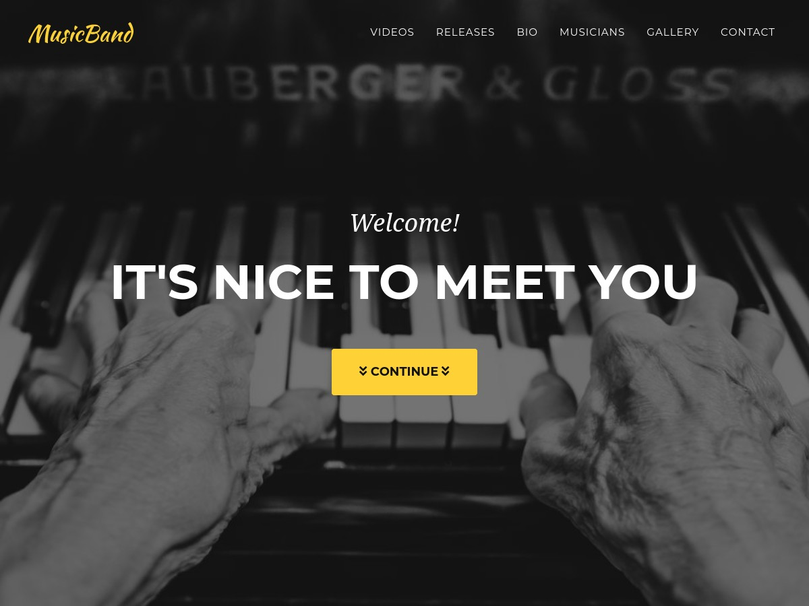

# MusicBand

> ⚠️ This project is **archived**. Development has moved to [MusicBandAstro](https://github.com/rolodoom/musicband-astro), a more maintainable and flexible Astro + Tailwind CSS version of this template.

[MusicBand](https://github.com/rolodoom/musicband) is a one page, musician page theme built with [Bootstrap](https://getbootstrap.com/) and forked from [Agency](https://startbootstrap.com/theme/agency) by [Start Bootstrap](https://startbootstrap.com/).

## Status

## Preview

**[View Live Preview](https://musicband-rolodoom.netlify.app/)**

## Usage

### Basic Usage

After downloading, simply edit the HTML and CSS files included with `dist` directory. These are the only files you need to worry about, you can ignore everything else! To preview the changes you make to the code, you can open the `index.html` file in your web browser.

### Advanced Usage

Clone the source files of the theme and navigate into the theme's root directory. Run `npm install` and then run `npm start` which will open up a preview of the template in your default browser, watch for changes to core template files, and live reload the browser when changes are saved. You can view the `package.json` file to see which scripts are included.

#### npm Scripts

- `npm run build` builds the project - this builds assets, HTML, JS, and CSS into `dist`
- `npm run build:assets` copies the files in the `src/assets/` directory into `dist`
- `npm run build:pug` compiles the Pug located in the `src/pug/` directory into `dist`
- `npm run build:scripts` brings the `src/js/scripts.js` file into `dist`
- `npm run build:scss` compiles the SCSS files located in the `src/scss/` directory into `dist`
- `npm run clean` deletes the `dist` directory to prepare for rebuilding the project
- `npm run start:debug` runs the project in debug mode
- `npm start` or `npm run start` runs the project, launches a live preview in your default browser, and watches for changes made to files in `src`

You must have npm installed in order to use this build environment.

## Bugs and Issues

Have a bug or an issue with this template? [Open a new issue](https://github.com/rolodoom/musicband/issues) here on GitHub.

## About

- Images generated by [Lorem Picsum](https://picsum.photos/) from [Unsplash](https://unsplash.com/) except on the Team Section.
- CD Cover Designs made on [Canva](https://canva.com).
- Here is the [list of images](src/IMAGES.md) used in this template.

## License

This code is released under the [GPL-3.0](https://github.com/rolodoom/musicband/blob/master/LICENSE) license, which means you have the four freedoms to run, study, share, and modify the software. Any derivative work must be distributed under the same or equivalent license terms.
