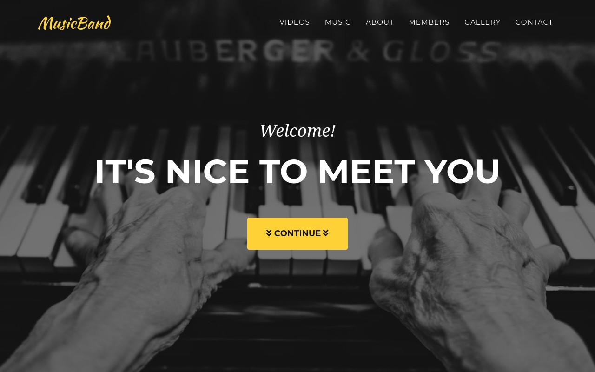

# [MusicBand](https://startbootstrap.com/theme/agency)

[MusicBand](https://startbootstrap.com/theme/agency) is a one page, musician page theme built with [Bootstrap](https://getbootstrap.com/) and forked from [Agency](https://startbootstrap.com/theme/agency) created by [Start Bootstrap](https://startbootstrap.com/). 

## Status
 

## Preview

## About

* Images generated by [Lorem Picsum](https://picsum.photos/) from  [Unsplash](https://unsplash.com/) except on the Team Section.
* CD Cover Designs made on [Canva](https://canva.com).
* Here is the [list of images](src/IMAGES.md) used in this template.
